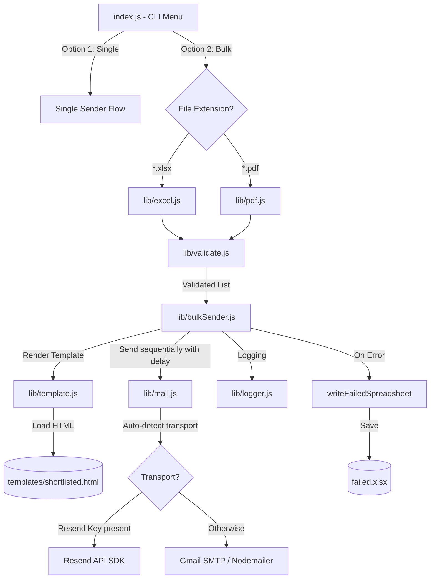

# Workflow Architecture: NEC 2026 Recruitment Mail Sender

This document outlines the architecture, data flow, and key components of the terminal-based email automation tool.

---

## 1. High-Level Architecture

The system is a modular CLI application built on Node.js. It supports single-email sending and sequential bulk-email processing from either an Excel spreadsheet (`.xlsx`) or a PDF file (`.pdf`). It features automated duplicate detection, email validation, HTML template rendering, log tracking, and failed-email auto-recovery.



---

## 2. Component Directory Structure

The application's modular components are organized as follows:

```text
email-automation/
├── templates/
│   └── shortlisted.html    # HTML Email template with {{name}}, {{date}}, and {{club}} placeholders
├── lib/
│   ├── mail.js             # Transport controller (Resend vs SMTP wrapper)
│   ├── validate.js         # Core validators for name formats and email patterns
│   ├── logger.js           # Logging utility for audit trails (saves to logs/)
│   ├── template.js         # Simple template engine replacing HTML variables
│   ├── excel.js            # Spreadsheet normalizer, header mapper, and failed-row exporter
│   ├── pdf.js              # Heuristic PDF text-miner for names/emails
│   └── bulkSender.js       # Orchestrates sequential sends, sleep delays, and CLI output
├── logs/                   # Directory where run-history log files are stored
├── index.js                # Core entry point and user command-line menu
├── package.json            # Node configuration, ESM flag ("type": "module"), and dependencies
└── .env                    # Local environment config (credentials, SMTP user/pass)
```

---

## 3. Workflow Pipelines

### A. Initialization & Transport Check
1. The app starts using `node index.js` (aliased to `npm start`).
2. It displays a banner and checks `.env` variables to auto-detect the active transport layer:
   * **Resend API**: Triggered if `RESEND_API_KEY` is present.
   * **Gmail SMTP**: Triggered if the API key is empty and SMTP credentials (`SMTP_USER`, `SMTP_PASS`) are found.
3. The detected transport is output in the CLI header.

### B. Single Email Pipeline
1. Prompt the user for the Candidate's Name and Target Email address.
2. Validate both inputs (Name must be characters, Email must match valid syntax).
3. Load the template, replace placeholders, and transmit via the active transport layer.

### C. Bulk Excel/PDF Pipeline
1. **Source Parsing & Header Mapping**:
   * **Excel (`.xlsx`)**: Handled by SheetJS (`xlsx`). Because Google Forms exports contain long question titles, the mapper normalizes column headers using substring detection (e.g., if a header contains "college email", it maps to the canonical `collegeEmail` key; if it contains "what is your name", it maps to `name`).
   * **PDF (`.pdf`)**: Uses Node's `createRequire` to safely import `pdf-parse` within ES module scopes. It extracts text line-by-line using regex heuristics to find the name and email fields.
2. **Validation & Filtering**:
   * Filters out rows with invalid names or malformed emails.
   * Performs deduplication (drops duplicate email entries in the sheet).
3. **Sequential Sending (Throttling)**:
   * Iterates through the list of candidates.
   * Sends the email to the target address (currently configured to send to the **Personal Email** if present, and skips candidates who do not have one).
   * **Delay Throttle**: Implements a `1.5s` delay between candidate emails to stay safely under Gmail SMTP hourly/daily limits and prevent server flags.
   * **Dry-Run Mode**: Allows users to preview parsed candidates, rows, and targeted emails in the terminal without transmitting them.
4. **Log & Error Recovery**:
   * Saves success or error reports to `logs/bulk-send-YYYY-MM-DD.log`.
   * If any emails fail to send, the app automatically writes their row details, emails, and exact error reasons to a fresh `./failed.xlsx` spreadsheet for direct retry.

---

## 4. Key Configurations

* **Gmail SMTP Constraints**: Free Google SMTP accounts limit outgoing messages to roughly 500 emails/day. The sequential `1500ms` delay throttles sending to preserve limits.
* **Failure Exporting**: Writes standard sheets using `failed.xlsx` mapping directly to the format required by the bulk parser, allowing immediate re-run on failures.
